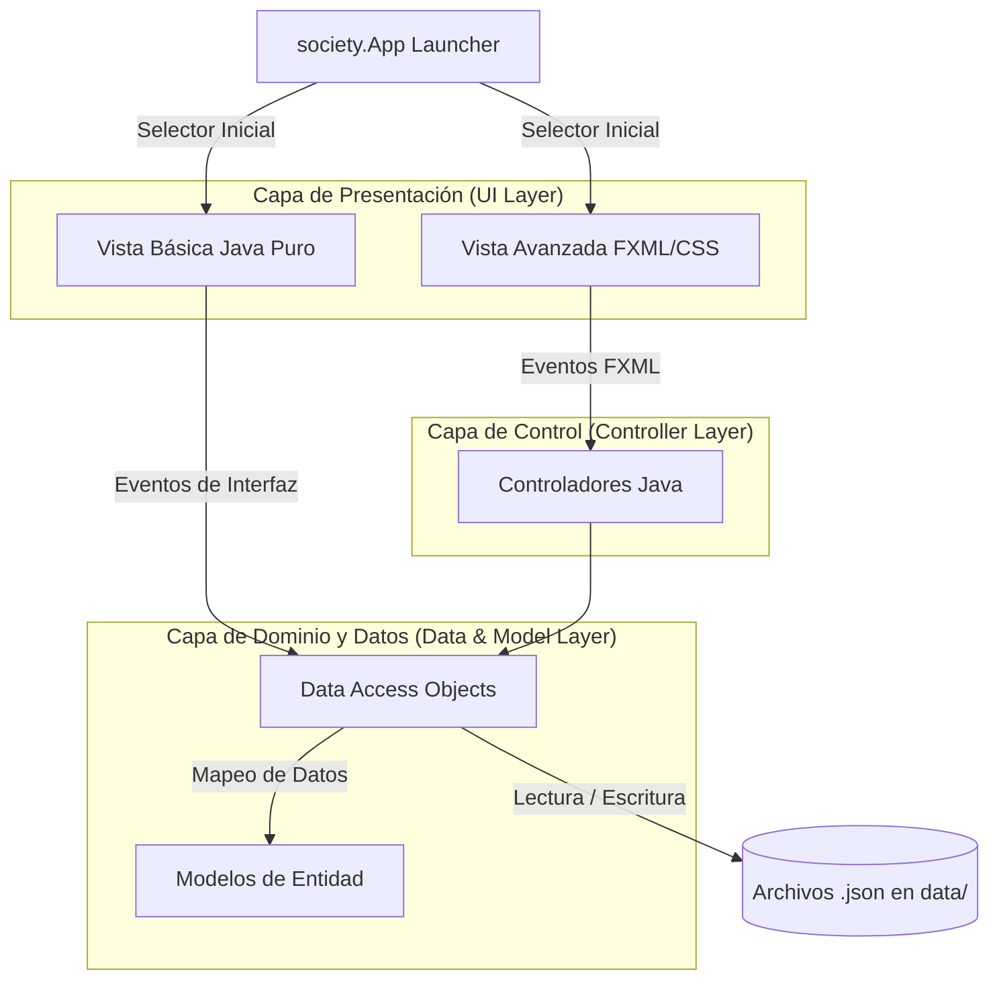

# VeterinariaUI - Proyecto Arquitectura MVC

Este proyecto implementa una arquitectura Modelo-Vista-Controlador (MVC) para una clínica veterinaria. Recientemente, se ha incorporado una **arquitectura de doble vista (Dual View)** que permite elegir entre una interfaz gráfica avanzada (FXML/CSS) y una interfaz gráfica básica (Java puro). 

El proyecto está estructurado de la siguiente manera:

## 1. Modelo (Model)
Ubicación: `veterui/src/main/java/society/modell`
Contiene las entidades del dominio o negocio, como `Veterinario`, `Cliente`, `Empleado`, `Mascota`, `Persona`, y demás subpaquetes (`clinica`, `facturacion`, `inventario`, `personas`).

## 2. Vista (View) - Arquitectura Dual
El proyecto ofrece dos versiones de la interfaz, seleccionables desde un Launcher (`society.App`):

- **Vista Avanzada (FXML):**
  Ubicación: `veterui/src/main/resources/society`
  Contiene los archivos de interfaz de usuario (`.fxml`) y hojas de estilo (`.css`). La vista se encarga exclusivamente de la presentación de los datos y de capturar las interacciones del usuario, enlazando eventos a los Controladores.
  
- **Vista Básica (Programática):**
  Ubicación: `veterui/src/main/java/society/view`
  Esta carpeta contiene una versión más básica y simplificada de las vistas. Mantiene la misma estructura modular que la versión avanzada, pero se construye enteramente usando código Java (`VBox`, `BorderPane`, `Label`, etc.) sin depender de FXML ni hojas de estilo complejas.

## 3. Controlador (Controller)
Ubicación: `veterui/src/main/java/society/controller`
Actúa como intermediario. Existen subpaquetes como `principales/` para las vistas principales y `reutilizables/` para componentes. Principalmente, cada archivo FXML de la vista avanzada está enlazado a uno de estos controladores mediante `fx:controller`.

## 4. Acceso a Datos (DAO - Data Access Object)
Ubicación: `veterui/src/main/java/society/dao`
Se encarga de la persistencia de datos. Actualmente configurado para guardar y leer información desde archivos `.json` ubicados en la carpeta local `data/` del proyecto.

---

## Arquitectura de Software
xxxxxxxxxx  
A continuación, se detalla el flujo de la aplicación mediante un diagrama de arquitectura que resalta la división entre las dos interfaces gráficas que comparten la misma lógica de negocio subyacente.

